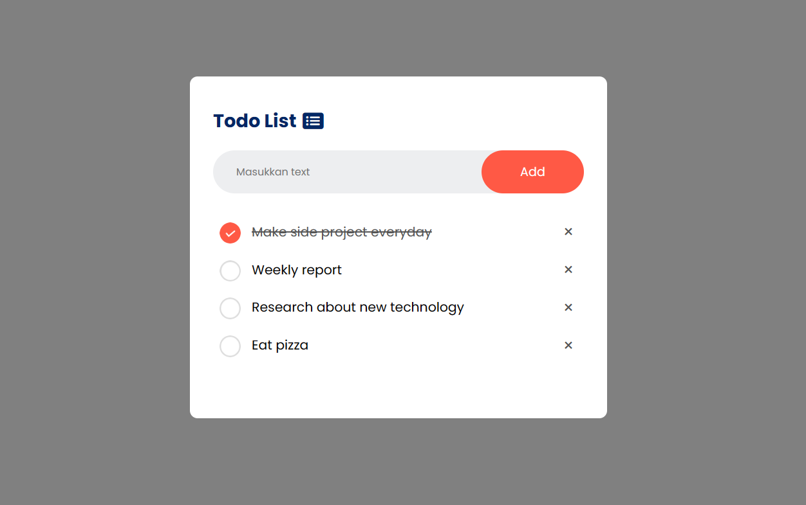

# Todo List App
A simple Todo List web application built using HTML, CSS, and JavaScript.

## Introduction
This Todo List app is a basic web application that allows users to add tasks, mark them as completed, and remove them from the list. The application is built using HTML for the structure, CSS for styling, and JavaScript for interactivity.

## Features
- Add tasks to the Todo list.
- Mark tasks as completed by clicking on them.
- Remove tasks from the list.

## Usage
- Open the index.html file in your preferred web browser.
- Enter a task in the input box and click the "Add" button to add it to the list.
- Click on a task to mark it as completed.
- Click on the "x" icon next to a task to remove it from the list.

## Image
